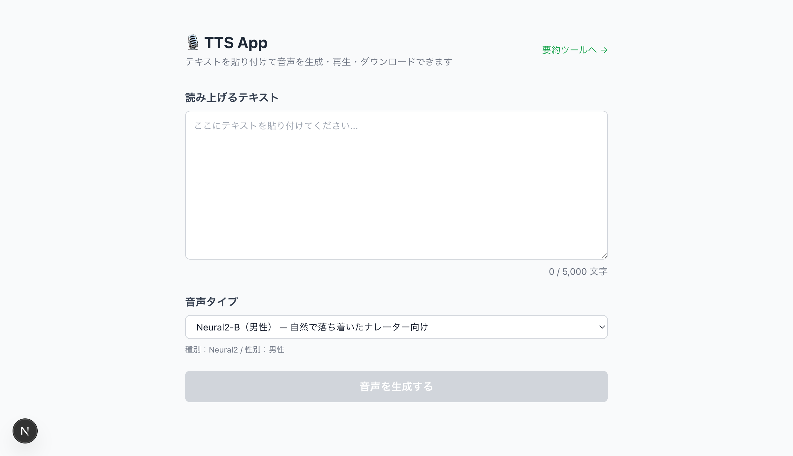
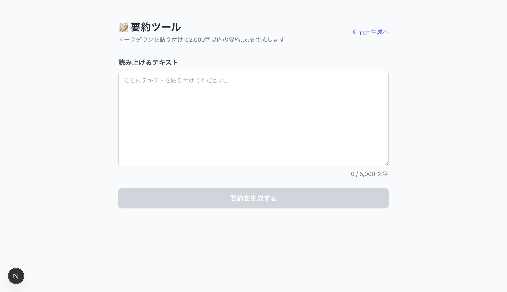
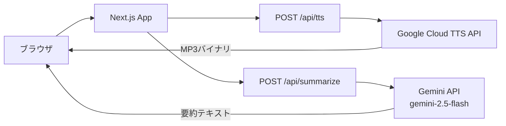

# TTS App

[](https://opensource.org/licenses/MIT)
[](https://nextjs.org/)
[](https://www.typescriptlang.org/)
[](https://cloud.google.com/text-to-speech)

> **テキストを貼り付けるだけで、すぐに音声を生成・再生・ダウンロードできるSNS発信支援ツール**

## デモ画面

| 音声生成ページ | 要約ページ |
|:--:|:--:|
|  |  |

## 概要

SNS初心者でも音声コンテンツを手軽に作れるWebアプリです。
有料の音声AI変換ツールはハードルが高い——そんな課題を解決するため、テキストを貼るだけでプロ品質の日本語音声を生成できるシンプルな仕組みを目指して作りました。

### なぜ作ったのか

- SNS発信に音声コンテンツを取り入れたいが、有料ツールは登録・操作が煩雑
- 「読み上げ音声を作る」というステップのハードルを限界まで下げたい
- Google Cloud TTSの高品質な日本語音声を、誰でも使いやすい形で提供したい

## 主な機能

- **テキスト → 音声変換**: 最大5,000文字のテキストをMP3音声に変換
- **複数音声タイプ**: Neural2・Standard など5種類の日本語音声から選択
- **ブラウザ内再生**: 生成した音声をその場でプレビュー再生
- **MP3ダウンロード**: 生成した音声ファイルをそのまま保存
- **記事要約ツール**: Gemini API（gemini-2.5-flash）でブログ記事を2,000字以内に要約してSNS投稿用テキストを生成

## 技術スタック

| カテゴリ | 技術 |
|:--|:--|
| フロントエンド | Next.js 15, React 19, TypeScript 5, Tailwind CSS 3 |
| バックエンド | Next.js API Routes |
| AI / 音声 | Google Cloud Text-to-Speech API, Gemini API (gemini-2.5-flash) |
| インフラ | Docker, Docker Compose |

## アーキテクチャ



## はじめ方

### 前提条件

- Docker / Docker Compose がインストール済みであること
- Google Cloud のサービスアカウントキー（JSON）が取得済みであること
- Gemini API キーが取得済みであること

### 環境変数の取得方法

#### 1. `GOOGLE_APPLICATION_CREDENTIALS_JSON`（音声生成で使用）

1. [GCP Console](https://console.cloud.google.com/) にアクセス
2. プロジェクトを選択（なければ新規作成）
3. **APIとサービス** → **ライブラリ** → `Cloud Text-to-Speech API` を検索して有効化
4. **IAMと管理** → **サービスアカウント** → サービスアカウントを作成
5. 作成したアカウントの **キー** タブ → **鍵を追加** → **新しい鍵を作成** → JSON を選択
6. ダウンロードしたJSONファイルを1行に変換：
   ```bash
   cat your-key.json | tr -d '\n'
   ```
7. 変換した文字列を `.env.local` の `GOOGLE_APPLICATION_CREDENTIALS_JSON` に設定

#### 2. `GEMINI_API_KEY`（要約機能で使用）

1. [Google AI Studio](https://aistudio.google.com/app/apikey) にアクセス
2. **Create API Key** をクリック
3. 発行されたAPIキーを `.env.local` の `GEMINI_API_KEY` に設定

### セットアップ

```bash
# リポジトリをクローン
git clone https://github.com/ryusei2790/tts-app.git
cd tts-app

# 環境変数を設定
cp .env.example .env.local
```

`.env.local` を開き、取得した値を設定：

```env
GOOGLE_APPLICATION_CREDENTIALS_JSON={"type":"service_account","project_id":"your-project",...}
GEMINI_API_KEY=your_gemini_api_key
```

```bash
# Dockerで起動
docker compose up
```

http://localhost:3000 でアクセスできます。

## 使い方

### 音声生成（トップページ）

1. テキストエリアに読み上げたいテキストを入力（最大5,000文字）
2. **音声タイプ**をプルダウンから選択（Neural2-B / Neural2-C / Standard-A など）
3. **「音声を生成する」** ボタンをクリック
4. 生成完了後、ブラウザ上で音声をプレビュー再生
5. **ダウンロードボタン**でMP3ファイルを保存

### 記事要約（`/summarize`）

1. 右上の **「要約ツールへ →」** リンクをクリック
2. テキストエリアにブログ記事のマークダウンを貼り付け
3. **「要約を生成する」** ボタンをクリック
4. Gemini APIが2,000字以内の要約テキストを生成
5. 結果をコピーまたは `.txt` ファイルとしてダウンロード

## 開発用コマンド

```bash
# 起動
docker compose up

# バックグラウンドで起動
docker compose up -d

# ログを確認
docker compose logs -f

# 停止
docker compose down

# コンテナを再ビルド（依存関係の変更時）
docker compose up --build
```

## ライセンス

このプロジェクトは [MIT License](LICENSE) の下で公開されています。
