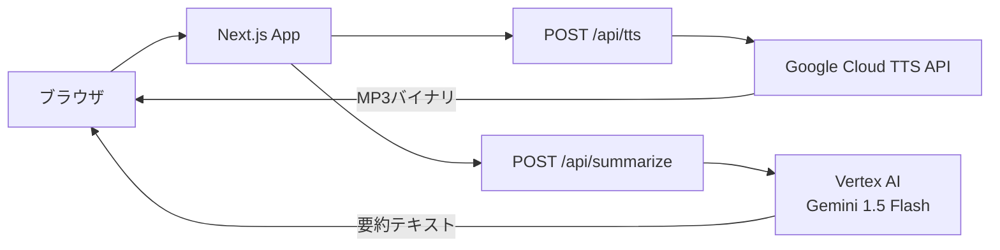

# 🎙️ TTS App

[](https://opensource.org/licenses/MIT)
[](https://nextjs.org/)
[](https://www.typescriptlang.org/)
[](https://cloud.google.com/text-to-speech)

> **テキストを貼り付けるだけで、すぐに音声を生成・再生・ダウンロードできるSNS発信支援ツール**

<!-- スクリーンショット（追加予定） -->
<!--  -->

## 📖 概要

SNS初心者でも音声コンテンツを手軽に作れるWebアプリです。
有料の音声AI変換ツールはハードルが高い——そんな課題を解決するため、テキストを貼るだけでプロ品質の日本語音声を生成できるシンプルな仕組みを目指して作りました。

### なぜ作ったのか（モチベーション）

- SNS発信に音声コンテンツを取り入れたいが、有料ツールは登録・操作が煩雑
- 「読み上げ音声を作る」というステップのハードルを限界まで下げたい
- Google Cloud TTSの高品質な日本語音声を、誰でも使いやすい形で提供したい

## ✨ 主な機能

- **テキスト → 音声変換**: 最大5,000文字のテキストをMP3音声に変換
- **複数音声タイプ**: Neural2・Standard など5種類の日本語音声から選択
- **ブラウザ内再生**: 生成した音声をその場でプレビュー再生
- **MP3ダウンロード**: 生成した音声ファイルをそのまま保存
- **記事要約ツール**: Gemini（Vertex AI）でブログ記事を2,000字以内に要約してSNS投稿用テキストを生成

## 🛠 技術スタック

| カテゴリ | 技術 |
|:--|:--|
| フロントエンド | Next.js 15, React 19, TypeScript 5, Tailwind CSS 3 |
| バックエンド | Next.js API Routes |
| AI / 音声 | Google Cloud Text-to-Speech API, Vertex AI (Gemini 1.5 Flash) |
| インフラ | Docker, Docker Compose |

## 🏗 アーキテクチャ



## 🚀 はじめ方

### 前提条件

- Docker / Docker Compose がインストール済みであること
- Google Cloud のサービスアカウントキー（JSON）が取得済みであること
  - 必要なAPI: `Cloud Text-to-Speech API`, `Vertex AI API`

### セットアップ

```bash
# リポジトリをクローン
git clone https://github.com/YOUR_USERNAME/tts-app.git
cd tts-app

# 環境変数を設定
cp .env.example .env.local
# .env.local を開き、GOOGLE_APPLICATION_CREDENTIALS_JSON にサービスアカウントJSONを1行で設定
```

`.env.local` の記述例:
```env
GOOGLE_APPLICATION_CREDENTIALS_JSON={"type":"service_account","project_id":"..."}
```

```bash
# Dockerで起動
docker compose up
```

http://localhost:3000 でアクセスできます。

## 📄 ライセンス

このプロジェクトは [MIT License](LICENSE) の下で公開されています。
